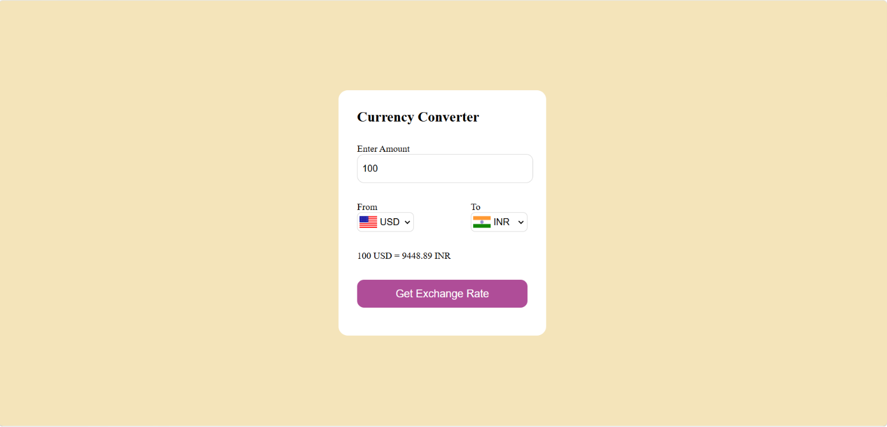

#  Currency Converter

A simple and responsive Currency Converter built using **HTML, CSS, and JavaScript** that converts currencies using real-time exchange rates.

##  Preview




##  Features

-  Convert between multiple international currencies
-  Real-time exchange rates using an API
-  Country flags update automatically based on the selected currency
-  Simple and responsive user interface
-  Instant conversion results

---

##  Technologies Used

- HTML5
- CSS3
- JavaScript (ES6)
- Exchange Rate API
- Flags API

---

##  Project Structure

```
CurrencyConverter/
│── index.html
│── style.css
│── app.js
│── code.js
└── README.md
```

---

## Getting Started

1. Clone this repository

```bash
git clone https://github.com/bhavikarka2006-lab/CurrencyConverter.git
```

2. Open the project folder.

3. Open `index.html` in your browser.

No installation or additional setup is required.

---

##  What I Learned

This project helped me improve my understanding of:

- Fetch API
- Async/Await
- Working with REST APIs
- DOM Manipulation
- Event Handling
- Dynamic UI Updates
- JavaScript Promises

---

##  Future Improvements

-  Swap currencies with one click
-  Dark Mode
-  Favorite currencies
-  Conversion history
-  Better mobile responsiveness
-  Exchange rate charts

---

##  Author

**Bhavesh Reddy**

GitHub: https://github.com/bhavikarka2006-lab

---

##  Show Your Support

If you found this project useful or interesting, consider giving it a ⭐ on GitHub.
